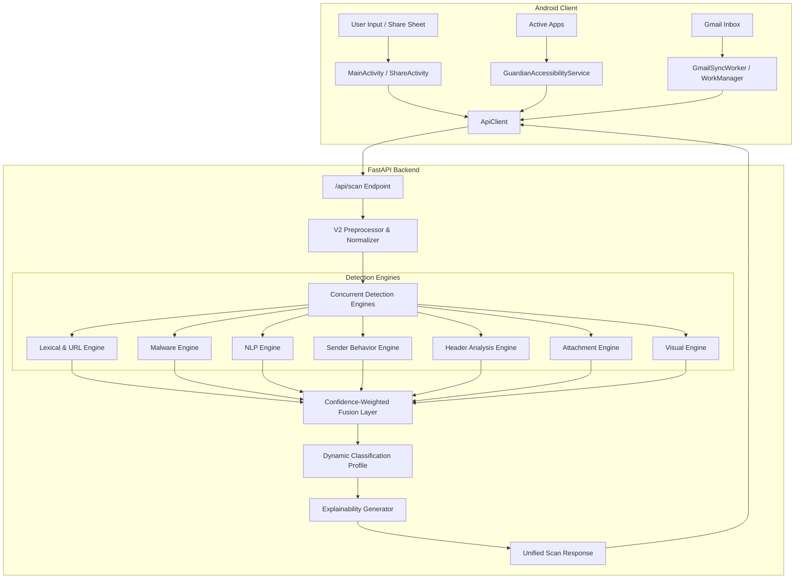

# SecureShield AI

SecureShield AI is an intelligent mobile and email security platform consisting of a native Android client application and a modular FastAPI threat-detection backend. It provides multi-layered threat detection for shared URLs, uploaded files, real-time screen content (Guardian Mode), and user-authorized Gmail messages.

---

## 1. Project Overview

SecureShield AI protects users against phishing, malware, deceptive messaging, and email spoofing. It combines lightweight client-side protection with a multi-engine backend analysis pipeline, aggregating threat signals into clear risk scores (0–100), classifications, explainable reasons, and actionable security recommendations.

---

## 2. Main Capabilities

- **Global Share Target**: Accepts text, links, and files shared directly from any Android app via system share sheets.
- **Guardian Mode**: Accessibility-powered real-time protection detecting suspicious links and malicious content in active apps.
- **Gmail Intelligence**: On-demand and background scanning of unread Gmail messages using read-only Google OAuth scopes.
- **Background Protection**: Privacy-conscious background inbox monitoring via Android `WorkManager` with actionable alerts.
- **Multi-Engine Detection**: 7 specialized detection engines analyzing URLs, file payloads, text semantics, sender patterns, headers, attachments, and visual brand spoofing.
- **Confidence-Weighted Fusion & Explainability**: Aggregates engine threat signals using a confidence-weighted average (0–100), categorical classification, evidence summaries, and clear mitigation advice.
- **Local Scan History**: Fully offline local SQLite storage for past scan results on the Android device with filtering and deletion support.
- **Privacy-Preserving Server Storage**: Raw message bodies, unredacted text snippets, passwords, tokens, attachments, and file contents are processed strictly in-memory and never written to disk. The backend only stores scoped sender behavioral metadata (`sender_behavior.db`) and user accuracy ratings (`feedback.db`).
- **User Feedback & Evaluation**: Anonymous scan-bound feedback reporting to track aggregate telemetry metrics.

---

## 3. Architecture Overview



---

## 4. Android Application

The Android client is built with Kotlin and target SDK 34 (Android 14), with support back to Android 7.0 (API 24).

### Key Components
- **`MainActivity`**: Primary dashboard for direct URL/text scanning, scan results display, and navigation.
- **`ShareActivity`**: Global intent filter (`android.intent.action.SEND`) handling links and file shares from third-party apps.
- **`GuardianAccessibilityService`**: Real-time overlay alert system scanning URLs surfaced in active apps.
- **`GmailSyncWorker`**: WorkManager background job running periodic scans on new unread messages.
- **`ScanHistoryManager`**: Local SQLite database (`secure_scan_history.db`) for offline history viewing.
- **`ApiClient`**: Network client interacting with the FastAPI `/api/scan` and `/api/feedback` endpoints with client API key authentication.

---

## 5. FastAPI Backend

The backend is built with Python 3.10+ and FastAPI, designed for high-concurrency asynchronous evaluation.

### Core Modules
- **`app/api/`**: API routes including `/api/scan`, `/api/feedback`, `/api/evaluation/metrics`, and `/health`, secured with `X-API-Key` authentication and per-client rate limiting.
- **`app/preprocessing/`**: Input sanitization, Unicode NFKC normalization, URL unshortening, and file bounds enforcement.
- **`app/engines/`**: 7 independent threat detection engine implementations.
- **`app/fusion/`**: Confidence-weighted average fusion calculating composite threat scores and aggregate confidence levels.
- **`app/classification/`**: Declarative classification profiles (`default`, `strict`, `enterprise`) mapping risk scores to categories: `Safe`, `Suspicious`, `Deceptive`, `Phishing`, `Malware`.
- **`app/explainability/`**: Rule-based narrative engine converting technical flags into user-friendly explanations.
- **`app/database/`**: Scoped SQLite storage for sender behavioral baselines (`sender_behavior.db` keyed by `(client_id, sender_id)`) and feedback submissions (`feedback.db`).

---

## 6. Server Storage & Privacy Architecture

The backend operates with strict data boundaries:

| Data Category | Handled In-Memory? | Written to Disk? | Description / Retention |
| :--- | :--- | :--- | :--- |
| **Message Text & URLs** | Yes | **No** | Normalized and scanned in memory; discarded immediately after response generation. |
| **Files & Attachments** | Yes | **No** | Inspected in memory up to 10 MB limit; byte payloads are never stored. |
| **Sender Metadata** | Yes | **Yes** (`sender_behavior.db`) | Scoped to `(client_id, sender_id)` and `(client_id, display_name)`. Stores interaction counts, timestamps, hourly buckets, and domain history for anomaly detection. |
| **User Feedback** | Yes | **Yes** (`feedback.db`) | Stores `scan_id`, feedback rating (`positive`/`negative`), classification, risk score, confidence, and source type for telemetry. |

---

## 7. Detection Engines

| Engine | Primary Function | Data Sources / Techniques |
| :--- | :--- | :--- |
| **Lexical & URL** | URL structure and reputation analysis | Heuristics, entropy analysis, Google Safe Browsing API |
| **Malware** | File payload inspection | Magic bytes validation, hash extraction, VirusTotal API |
| **NLP** | Social engineering & phishing intent | Urgency detection, credential lure patterns, keyword matching |
| **Sender Behavior** | Anomaly detection in sender behavior | Tenant-scoped SQLite behavioral state, frequency checks |
| **Header Analysis** | Email authentication and spoofing | SPF, DKIM, DMARC verification, Received hop analysis |
| **Attachment** | Static attachment safety | Static structure inspection, double-extension & RTLO detection, macro check |
| **Visual** | Phishing brand impersonation | QR code decoding, OCR text extraction, credential form heuristics |

---

## 8. Known Limitations

1. **Linguistic Scope**: NLP heuristic rules, keyword patterns, and regex tokenizers are currently tailored for English-language text and phishing templates.
2. **Guardian Mode Visibility**: The Android Accessibility Service only reads visible on-screen text nodes and URLs rendered in active foreground windows; it cannot inspect encrypted network packets, DRM-protected views, or canvas-rendered graphics without OCR.
3. **Reactive Detection Timing**: Alerts are generated reactively once suspicious text or links appear on screen, rather than acting as a preemptive network firewall or DNS proxy.
4. **Cloud Hosting Constraints**: Free-tier deployments (e.g. Render / Railway free tiers) experience cold-start spin-up latency (~30–50s) and ephemeral local disk resets unless persistent volume mounts (`DATA_DIR`) or external databases are configured.
5. **Platform & OAuth Verification**: Direct Google Sign-In with Gmail scopes requires configuring OAuth 2.0 SHA-1 client fingerprints in Google Cloud Console and Google app verification for public accounts; Android Accessibility and Notification permissions require explicit manual user authorization.

---

## 9. How to Run Locally

### Backend Setup
1. **Prerequisites**: Python 3.10+ installed.
2. **Navigate to backend**:
   ```bash
   cd backend
   ```
3. **Create & activate virtual environment**:
   ```bash
   python -m venv .venv
   # Windows:
   .venv\Scripts\activate
   # Linux / macOS:
   source .venv/bin/activate
   ```
4. **Install dependencies**:
   ```bash
   pip install -r requirements.txt
   ```
5. **Configure environment variables**:
   Create a `.env` file from `.env.example`:
   ```env
   API_KEY=your_secure_api_key
   GOOGLE_SAFE_BROWSING_API_KEY=your_key_here  # Optional (graceful fallback)
   VIRUSTOTAL_API_KEY=your_key_here            # Optional (graceful fallback)
   ENVIRONMENT=development
   ```
6. **Start the backend server**:
   ```bash
   uvicorn main:app --reload --host 0.0.0.0 --port 8000
   ```
   Or use the root convenience script: `.\start_backend.bat` (Windows).

### Android Client Setup
1. Open the `android/` directory in Android Studio.
2. Ensure Android 14 (API 34) SDK is installed.
3. Set the backend URL in `android/local.properties` (or use default `http://10.0.2.2:8000/` for emulator):
   ```properties
   BASE_URL="http://10.0.2.2:8000/"
   ```
4. Build and run on an Android device or emulator:
   ```bash
   cd android
   .\gradlew assembleDebug
   ```

---

## 10. Production & Cloud Backend

- **Live Production URL**: `https://secureshield-ai-production.up.railway.app`
- **Health Endpoint**: `https://secureshield-ai-production.up.railway.app/health`
- **Deployment Platform**: Railway / Render (auto-deployed via CI/CD).
- **CI/CD**: GitHub Actions workflows (`.github/workflows/android-ci-cd.yml` and `.github/workflows/backend-ci-cd.yml`) automatically build APKs, execute test suites, and deploy on push.

---

## 11. Testing & Verification

### Automated Test Suites
- **Total Automated Tests**: **319 tests passing**
  - **Backend (Pytest)**: 199 passing tests covering all 7 detection engines, V2 preprocessor sanitization, authentication, rate limiting, and SQLite multi-tenant persistence.
  - **Android (JUnit / Robolectric)**: 120 passing unit tests covering UI flows, accessibility guardian services, network client serialization, feedback managers, and background sync workers.
- **Accuracy Evaluation**: Empirical detection accuracy on labeled benchmark datasets is measured and tracked separately from the deterministic unit/regression test suites.

### Running Backend Tests
```bash
cd backend
python -m pytest app/tests -v --tb=short
```

### Running Android Tests
```bash
cd android
.\gradlew testDebugUnitTest
```

### Full Clean Build Verification
```bash
cd android
.\gradlew clean testDebugUnitTest assembleDebug
```

---

## 12. Project Structure

```text
SecureShield-AI/
├── .github/
│   └── workflows/
│       ├── android-ci-cd.yml     # Android build, test, and release workflow
│       └── backend-ci-cd.yml     # Backend test and auto-deploy workflow
├── android/
│   ├── app/                      # Android application module (Kotlin)
│   │   ├── src/main/java/com/secureshield/ai/
│   │   │   ├── accessibility/    # Guardian Mode accessibility service
│   │   │   ├── background/       # WorkManager background Gmail scanning
│   │   │   ├── feedback/         # User feedback submission logic
│   │   │   ├── history/          # Local SQLite scan history repository
│   │   │   ├── network/          # Retrofit / ApiClient network layer
│   │   │   └── share/            # Android Share Target intent receiver
│   │   └── build.gradle.kts      # Android app build configuration
│   └── build.gradle.kts          # Top-level Gradle configuration
├── backend/
│   ├── app/
│   │   ├── api/                  # FastAPI endpoints & routes
│   │   ├── classification/       # Dynamic risk classification profiles
│   │   ├── config/               # Settings & environment configuration
│   │   ├── database/             # SQLite state & database access
│   │   ├── engines/              # 7 modular detection engines
│   │   ├── evaluation/           # Feedback & evaluation metrics
│   │   ├── explainability/       # Human-readable explanation generation
│   │   ├── fusion/               # Confidence-weighted risk score fusion
│   │   ├── models/               # Pydantic data schemas & interfaces
│   │   ├── preprocessing/        # Input sanitization & normalization
│   │   └── tests/                # Pytest unit & integration test suite
│   ├── data/                     # SQLite database storage directory
│   ├── main.py                   # FastAPI application entry point
│   └── requirements.txt          # Python dependencies
├── documentation/
│   ├── API.md                    # REST API endpoint reference & schemas
│   ├── ARCHITECTURE.md           # Detailed architecture & engine pipeline
│   ├── DEPLOYMENT.md             # Cloud deployment & CI/CD guides
│   └── DEVELOPMENT.md            # Local setup, testing & signing guide
├── .env.example                  # Environment variable template
├── .gitignore                    # Git ignore rules
├── DEMO_SCRIPT.md                # Demonstration script for evaluations
├── DEPLOYMENT.md                 # Root deployment summary
├── README.md                     # Project overview & quick start guide
├── start_backend.bat             # Windows batch startup script
└── start_backend.ps1             # PowerShell startup script
```
