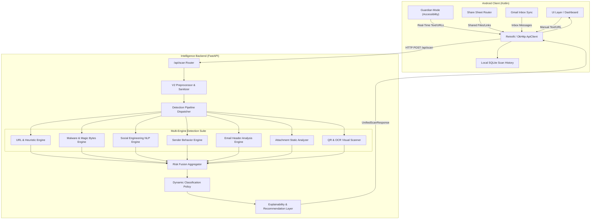

# SecureShield AI — System Architecture

## 1. High-Level Architecture

SecureShield AI is an end-to-end mobile threat detection platform consisting of a Kotlin Android application and a modular Python (FastAPI) intelligence backend.

---

## 2. Detection Pipeline Lifecycle

1. **Ingestion & Sanitization (`backend/app/preprocessing/`):**
   - Normalizes unicode, decodes obfuscated URLs, bounds payload sizes, strips unsafe control characters.
   - Extracts nested URLs and metadata structures safely.

2. **Parallel Engine Execution (`backend/app/engines/`):**
   - Every active detection engine implements `BaseEngine`.
   - Engines execute concurrently with timeout bounding and isolated failure recovery.

3. **Risk Fusion & Scoring (`backend/app/fusion/`):**
   - Calculates a confidence-weighted average threat score (0.0 to 100.0) from usable engine results (`weight = confidence * reliability * status_factor`).
   - Evaluates overrides for definitive malware indicators (VirusTotal hash match or high malware threat score).
   - Applies declarative classification profiles: `Safe`, `Suspicious`, `Deceptive`, `Phishing`, `Malware`.

4. **Explainability & Actions (`backend/app/explainability/`):**
   - Translates machine flags into human-readable evidence summaries.
   - Generates actionable safety advice (e.g., *"Do not enter login credentials on this domain"*).

---

## 3. Storage & Privacy Architecture

- **Transient Processing**: Raw text bodies, unredacted snippets, passwords, tokens, attachments, and uploaded files are processed strictly in memory and are never persisted to disk.
- **Backend Databases**:
  - `sender_behavior.db`: Scoped by `(client_id, sender_id)` and `(client_id, display_name)`. Tracks interaction counts, timestamps, hourly frequency buckets, and domain histories for anomaly detection.
  - `feedback.db`: Stores scan feedback telemetry (`scan_id`, rating, classification, risk score, confidence, source type).
- **Client Database**:
  - `secure_scan_history.db`: Local SQLite database on the Android device storing past scan summaries for offline user history.

---

## 4. Multi-Engine Detection Suite

| Engine | Primary Function | Key Indicators Detected |
| :--- | :--- | :--- |
| **URL Engine** | Heuristic URL analysis & reputation lookup | IP-based hosts, punycode spoofing, high-risk TLDs, Google Safe Browsing. |
| **Malware Engine** | Static binary validation | Extension vs Magic-byte mismatches, executable payloads, VirusTotal v3 lookup. |
| **NLP Engine** | Social engineering & linguistic analysis | Credential harvesting patterns, urgent threats, financial coercion, fake security alerts. |
| **Sender Behavior** | Historical sender anomaly tracking | Multi-tenant tenant-isolated first-time senders, volume spikes, domain divergence. |
| **Header Engine** | Email authentication verification | SPF / DKIM / DMARC failures, spoofed `From` vs `Return-Path` headers. |
| **Attachment Engine** | Static document & archive safety | Double extensions, VBA macros, embedded script elements, zip bomb structures. |
| **Visual Engine** | QR decoding & OCR extraction | Embedded phishing URLs in images, fake login screenshots, credential forms. |

---

## 5. Android Client Architecture

The Android application is organized into modular packages:

- **`accessibility/`**: `UniversalLinkGuardService` monitors on-screen window content in real time with content-hash debouncing and rate limiting.
- **`network/`**: `ApiClient`, `ClientIdProvider`, and `ServerSettings` manage Retrofit communication, persistent device UUID generation, runtime server switching, and health probes.
- **`history/`**: `ScanHistoryDatabase` provides SQLite local caching of past verdicts without storing sensitive raw user data.
- **`background/`**: `ThreatAlertWorker` executes periodic WorkManager sync for unread inbox threat analysis.
- **`feedback/`**: `FeedbackSubmissionManager` coordinates positive/negative scan verdict telemetry.
- **`share/`**: `SharedIntentRouter` handles implicit share intents from external apps (WhatsApp, Chrome, Gmail).

---

## 6. Known Limitations & Constraints

1. **Linguistic Heuristics**: NLP and rule-based semantics currently evaluate English-language phishing and social engineering templates.
2. **Guardian Accessibility Scope**: Guardian Mode reads visible on-screen text nodes and links rendered in active windows; it cannot intercept encrypted network sockets, DRM-protected video surfaces, or canvas drawing operations without OCR.
3. **Reactive Detection**: Threat alerts appear after content is rendered on the screen rather than operating as a network proxy or firewall.
4. **Cloud Free-Tier Hosting**: Free-tier cloud instances have spin-down latency (~30–50s cold start) and ephemeral local disk storage unless persistent disk volumes or managed external databases are mounted.
5. **Platform Permissions & OAuth**: Gmail API access requires OAuth 2.0 SHA-1 registration in Google Cloud Console; Accessibility and Notification features require user-granted Android permissions.

---

## 7. Testing & Quality Verification

- **319 Automated Tests Passing**:
  - **199 Backend Tests**: Validating all 7 engines, pipeline concurrency, V2 preprocessing sanitization, rate limiting, and multi-tenant SQLite persistence.
  - **120 Android Tests**: Validating UI workflows, Accessibility guardian logic, network client serialization, and background workers.
- **Accuracy Evaluation**: Empirical detection accuracy on labeled ground-truth datasets is evaluated and tracked separately from code-level unit and regression suites.

