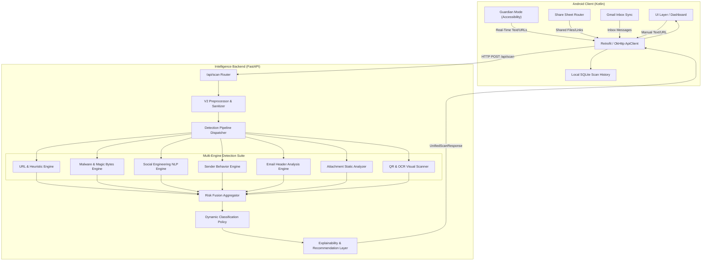

# SecureShield AI — System Architecture

## 1. High-Level Architecture

SecureShield AI is an end-to-end mobile threat detection platform consisting of a Kotlin Android application and a modular Python (FastAPI) intelligence backend.

---

## 2. Detection Pipeline Lifecycle

1. **Ingestion & Sanitization (`backend/app/preprocessing/`):**
   - Normalizes unicode, decodes obfuscated URLs, bounds payload sizes, strips unsafe control characters.
   - Extracts nested URLs and metadata structures safely.

2. **Parallel Engine Execution (`backend/app/engines/`):**
   - Every active detection engine implements `BaseEngine`.
   - Engines execute concurrently with timeout bounding and isolated failure recovery.

3. **Risk Fusion & Scoring (`backend/app/fusion/`):**
   - Calculates a confidence-weighted threat score (0.0 to 100.0) from contributing engine results.
   - Applies deterministic category thresholds: `Safe`, `Suspicious`, `Deceptive`, `Phishing`, `Malware`.

4. **Explainability & Actions (`backend/app/explainability/`):**
   - Translates machine flags into human-readable evidence summaries.
   - Generates actionable safety advice (e.g., *"Do not enter login credentials on this domain"*).

---

## 3. Multi-Engine Detection Suite

| Engine | Primary Function | Key Indicators Detected |
| :--- | :--- | :--- |
| **URL Engine** | Heuristic URL analysis & reputation lookup | IP-based hosts, punycode spoofing, high-risk TLDs, Google Safe Browsing. |
| **Malware Engine** | Static binary validation | Extension vs Magic-byte mismatches, executable payloads, VirusTotal v3 lookup. |
| **NLP Engine** | Social engineering & linguistic analysis | Credential harvesting patterns, urgent threats, financial coercion, fake security alerts. |
| **Sender Behavior** | Historical sender anomaly tracking | First-time unseen senders, sudden volume spikes, domain divergence. |
| **Header Engine** | Email authentication verification | SPF / DKIM / DMARC failures, spoofed `From` vs `Return-Path` headers. |
| **Attachment Engine** | Static document & archive safety | Double extensions, VBA macros, embedded script elements, zip bomb structures. |
| **Visual Engine** | QR decoding & OCR extraction | Embedded phishing URLs in images, fake login screenshots, credential forms. |

---

## 4. Android Client Architecture

The Android application is organized into modular packages:

- **`accessibility/`**: `UniversalLinkGuardService` monitors on-screen window content in real time with content-hash debouncing and rate limiting.
- **`network/`**: `ApiClient` and `ServerSettings` manage Retrofit communication, runtime server switching, and health probes.
- **`history/`**: `ScanHistoryDatabase` provides SQLite local caching of past verdicts without storing sensitive raw user data.
- **`background/`**: `ThreatAlertWorker` executes periodic WorkManager sync for unread inbox threat analysis.
- **`feedback/`**: `FeedbackSubmissionManager` coordinates positive/negative scan verdict telemetry.
- **`share/`**: `SharedIntentRouter` handles implicit share intents from external apps (WhatsApp, Chrome, Gmail).
