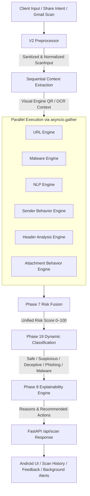

# SecureShield AI — V2 Release Readiness & Verification Checklist

> **Phase 20 — Final Integration, Hardening & Release Readiness**  
> **Status**: COMPLETED & VERIFIED  
> **Scope**: Backend (FastAPI, Python 3.10+) & Android Mobile Application (Kotlin, API 24–34)

---

## 1. Architecture Status

The V2 threat-detection pipeline architecture is fully implemented, verified, and operational end-to-end:



### Pipeline Execution Order
1. **Input Normalization**: `V2Preprocessor` sanitizes, trims, and bounds inputs. Bounded length (50,000 characters), file size limit (10 MB), and dangerous URI schemes (`javascript:`, `data:`, `vbscript:`) are strictly rejected.
2. **Sequential Visual Pre-Analysis**: `visual_engine` extracts embedded QR codes and OCR text to feed downstream engines prior to parallel branch.
3. **URL Redirect Resolution**: Safe, private redirect resolution without external credential exposure.
4. **Concurrent Detection**: All applicable engines execute concurrently with bounded per-engine timeouts (30s) and error isolation (`EngineResult.error` / `EngineResult.skipped`).
5. **Phase 7 Risk Fusion**: Computes single confidence-weighted risk score (0.0 to 100.0).
6. **Phase 19 Classification Policy**: Applies selected profile (`default`, `strict`, or `enterprise`) and strictly enforces the malware safeguard.
7. **Phase 8 Explainability**: Generates user-facing reasons, indicators, and recommended actions.
8. **Client Presentation**: Android parses response schema via `UnifiedScanResponseParser`, displays verdict cards, records local history (`secure_scan_history.db`), and supports optional user feedback.

---

## 2. Implemented Engines & Intelligence Features

| Component / Layer | Primary File | Responsibility |
|---|---|---|
| **V2 Preprocessor** | `backend/app/preprocessing/v2_preprocessor.py` | Centralized sanitization, Unicode NFKC, URI validation, length & size limits |
| **URL Engine** | `backend/app/engines/url_engine.py` | Lexical heuristics, entropy, IP-in-hostname, TLD checks, Safe Browsing lookup |
| **Malware Engine** | `backend/app/engines/malware_engine.py` | Magic-byte format verification, file hash checks, VirusTotal API integration |
| **NLP Engine** | `backend/app/engines/nlp_engine.py` | Social engineering urgency, authority lures, financial coercion patterns |
| **Visual Engine** | `backend/app/engines/visual_engine.py` | Offline QR code decoding, OCR text extraction, visual phishing indicators |
| **Sender Behavior Engine** | `backend/app/engines/sender_engine.py` | Local SQLite profile tracking, anomaly detection, cold-start protections |
| **Header Analysis Engine** | `backend/app/engines/header_analysis_engine.py` | SPF/DKIM/DMARC analysis, Reply-To mismatches, timestamp & hop anomaly checks |
| **Attachment Behavior Engine** | `backend/app/engines/attachment_behavior_engine.py` | Static-only inspection: double extensions, macros, script payloads, ZIP/TAR bounds |
| **Risk Fusion** | `backend/app/fusion/risk_fusion.py` | Single-pass confidence-weighted score calculation (0–100) |
| **Dynamic Classification** | `backend/app/classification/policy.py` | Declarative profiles (`default`, `strict`, `enterprise`) & malware signal boundary |
| **Explainability Engine** | `backend/app/explainability/explainability_engine.py` | Human-readable bulleted reasons and tiered recommended actions |
| **Android Client** | `android/.../MainActivity.kt` | UI verdict card, Share Intent receiver, Gmail OAuth integration |
| **Android Scan History** | `android/.../ScanHistoryRepository.kt` | Local SQLite store with privacy-preserving redaction and pagination |
| **Android Background Protection**| `android/.../ThreatAlertWorker.kt` | WorkManager periodic threat checks for newly received Gmail messages |
| **Android Feedback System** | `android/.../FeedbackSubmissionManager.kt` | Advisory user feedback tracking tied to scan UUIDs |

---

## 3. Security, Privacy & Safety Guarantees

- **No Remote Shell / Code Execution**: Attachment analysis and file handling are strictly static metadata and binary header inspections. Files and archives are NEVER executed, extracted to disk, or evaluated dynamically.
- **Privacy-Preserving Local Storage**: 
  - Android scan history redacts passwords, tokens, URLs, phone numbers, and emails before writing to `secure_scan_history.db`.
  - Raw attachments, bodies, passwords, and credentials are NEVER persisted in SQLite databases or application logs.
  - Feedback entries in SQLite store only scan UUIDs, evaluation scores, and categorical values.
- **Resource Safety & Bounded Limits**:
  - Maximum upload size: 10 MB strict limit (`MAX_FILE_BYTES`).
  - Maximum text length: 50,000 characters (`MAX_TEXT_LENGTH`).
  - Maximum URL length: 4,096 characters (`MAX_URL_LENGTH`).
  - Archive entry bounds: 200 entries max (`MAX_ARCHIVE_ENTRIES`), 50 MB uncompressed limit, 50:1 expansion ratio limit (`MAX_EXPANSION_RATIO`).
  - Bounded engine execution: 30-second timeout per engine.
- **Malware Safeguard**: High risk score alone never yields `Malware` without an authentic Phase 7 malware signal (`MALWARE`, `malware_detected`, `vt_malicious`, `vt_suspicious`).
- **Feedback Boundary**: User feedback is strictly advisory. Feedback data cannot automatically alter or retune security thresholds at runtime (`apply_feedback_tuning()` raises `PermissionError`).
- **No Accidental Secrets**: All API keys are optional environment variables; missing keys gracefully degrade to heuristic-only mode without pipeline crashes.

---

## 4. Verification & Test Summary

### Backend Test Suite
- **Command**: `cd backend && python -m pytest app/tests`
- **Total Tests Collected**: 174 items
- **Passed**: 174
- **Failures**: 0
- **Warnings**: 48 (third-party library deprecations only, zero application warnings)
- **Execution Time**: ~29 seconds

### Android Test & Build Suite
- **Command**: `cd android && .\gradlew clean test assembleDebug`
- **Unit Tests**: All unit tests passed (`testDebugUnitTest` 100% success)
- **Gradle Tasks**: 49 actionable tasks executed
- **Build Outcome**: `BUILD SUCCESSFUL`
- **Debug Artifact**: `android/app/build/outputs/apk/debug/app-debug.apk` (9,922,246 bytes)

---

## 5. Known Limitations & Operational Boundaries

1. **Heuristic & Rule-Based Detection**: SecureShield AI applies static rules, machine learning heuristics, and threat intelligence lookups. Passing tests does **not** guarantee 100% accuracy, malware immunity, or enterprise production certification.
2. **External API Quotas**: VirusTotal and Google Safe Browsing lookups rely on external API keys. When keys are unconfigured or rate limits are exceeded, engines fall back to local heuristic analysis.
3. **Background Execution Latency**: Background Gmail threat checks use Android `WorkManager`. Execution timing is governed by Android OS battery optimization and Doze mode; checks are periodic rather than real-time push.
4. **Visual & OCR Processing**: OCR (EasyOCR/PyTorch) operates on the host CPU in default configurations; image-heavy inputs may experience higher inference latency compared to pure text analysis.
5. **Archive Nesting Depth**: Deeply nested archives exceeding recursion depth or decompression limits are marked as suspicious anomalies rather than fully decompressed, preventing Zip-bomb Denial of Service.

---

## 6. Environment & API Key Requirements

Copy `.env.example` to `.env` or export environment variables:

| Variable | Required? | Default | Purpose |
|---|---|---|---|
| `ENVIRONMENT` | Optional | `development` | Runtime environment identifier |
| `PROJECT_NAME` | Optional | `SecureShield AI` | FastAPI documentation title |
| `GOOGLE_SAFE_BROWSING_API_KEY` | Optional | `None` | Google Safe Browsing v4 threat lookup |
| `VIRUSTOTAL_API_KEY` | Optional | `None` | VirusTotal v3 file hash reputation lookup |

*Note: All external keys are optional. The backend operates completely offline with heuristic analysis if keys are absent.*

---

## 7. Demo & Local Review Procedure

### Step 1: Start Backend Server
```bash
cd backend
python -m uvicorn main:app --host 0.0.0.0 --port 8000 --reload
```
Verify health check at: `http://localhost:8000/` or Swagger docs at `http://localhost:8000/docs`.

### Step 2: Validate Unified Scan Endpoint via cURL / PowerShell
```bash
curl -X POST "http://localhost:8000/api/scan" \
     -H "Content-Type: application/json" \
     -d '{"text": "URGENT: Your bank account is locked! Click http://verify-bank.com immediately."}'
```
Expected response:
- `status`: `"completed"`
- `classification`: `"Phishing"` or `"Suspicious"`
- `risk_assessment.reasons`: list of detected threat indicators
- `risk_assessment.recommended_action`: recommended user action

### Step 3: Test Dynamic Profiles
```bash
# Default Profile
curl -X POST "http://localhost:8000/api/scan" \
     -H "Content-Type: application/json" \
     -d '{"text": "Meeting update", "url": "http://192.168.1.1/info", "classification_profile": "default"}'

# Strict Profile
curl -X POST "http://localhost:8000/api/scan" \
     -H "Content-Type: application/json" \
     -d '{"text": "Meeting update", "url": "http://192.168.1.1/info", "classification_profile": "strict"}'
```

### Step 4: Run Android App in Emulator
1. Open `android/` in Android Studio.
2. In Android emulator (uses `http://10.0.2.2:8000/` by default).
3. Test Share Intent: Share a link or text from Chrome or Messages into SecureShield AI.
4. Verify the verdict card displays category badge, risk score, confidence, reasons, and recommended action.
5. Review Scan History activity to confirm records are logged and details are viewable.
